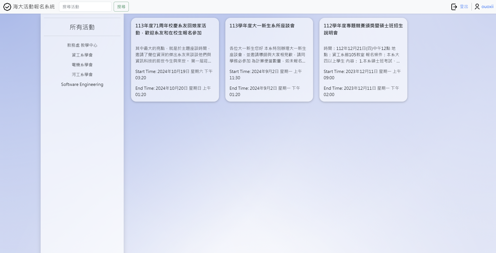

## 海大活動報名系統

系統網址: [ntou-event-registration-system](https://ntou-event-registration-system-production-42a5.up.railway.app/)

### 概述

「活動舵手 (Event Helmsman)」是一個專屬於校內活動管理的系統，整合校內各單位（如學生會、系學會、社團等）發布的活動資訊，提供一個集中的平台，讓學生和教職員方便地瀏覽並報名活動。同時，主辦單位也能更有效地管理活動參加者資訊，並透過自動化通知功能提升活動參與度。

### 主要功能與特色
1. 活動管理與報名：

    - 使用者可瀏覽並報名各類活動，系統支援活動篩選、分類與關鍵字搜尋。
    - 提供活動主辦方創建、編輯、刪除活動的功能，並可設定報名人數上限和候補機制。

2. 即時通知與行事曆整合：
    - 進階使用者可透過系統向活動參與者發送即時通知，提醒重要事項或更新。

3. 評論與反饋：
    - 活動結束後，使用者可在活動頁面留下評論，分享活動體驗，幫助主辦方改進未來活動品質。

4. 權限管理與安全機制：
    - 採用 JWT 進行用戶認證與 API 授權，確保系統的安全性與穩定性。
    - 系統管理員可以審核進階使用者申請，控制活動管理的權限分配。

### 技術架構與設計
#### 系統架構
**前端技術**
- 使用 HTML、CSS、JavaScript 設計響應式頁面，並引入 Bootstrap 框架提升 UI 一致性。
- 使用 jQuery 和 AJAX 技術與後端 API 進行資料交互。

**後端技術**
- 後端基於 Spring Boot 框架構建，使用 Spring Data MongoDB 與 MongoDB Atlas 整合數據儲存與操作。
- 使用 Spring Security 和 JWT 保護 API 安全

**資料庫**
- 使用 MongoDB 作為主要資料庫，利用其靈活的資料結構來存儲活動、用戶和報名資訊。

### 測試環境與工具

- 伺服器：Railway 部署環境，測試數據儲存在 MongoDB Atlas 中。
- 瀏覽器：Google Chrome，用於前端測試。
- 測試工具：
    - 使用 Postman 和 HTTPie 測試 API 功能。
    - 使用 MongoDB Compass 管理和檢視測試資料。

### 總結與未來發展
**計劃**

增加活動通知的模板化功能，提升使用者體驗。
開發手機 App 版本，進一步提升系統的易用性和流暢性。

**挑戰與解決方案**

挑戰 1：使用者資料安全性保障。
採用 JWT 和 HTTPS 保護資料傳輸，並對敏感資料（如密碼）進行雙向加密。

### 分工：
- 01057042 吳柏頡 (@ntou01057042) -> 後端（API、帳號系統）
- 01057055 宋威儀(@vvvvss) -> 前端（設計多一點）
- **01057051 陳俞君([@ouoxii](https://github.com/ouoxii)) -> 前端（實作多一點）**
- 01057014 洪淵傳(@帳號已消失) -> 黑名單功能（部分前端、部分後端）(未完成)
- 01057020 林佑丞(@xiaoyo123) -> 後端（API）

